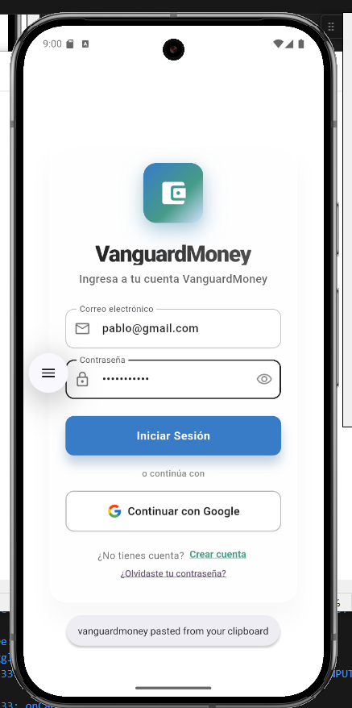
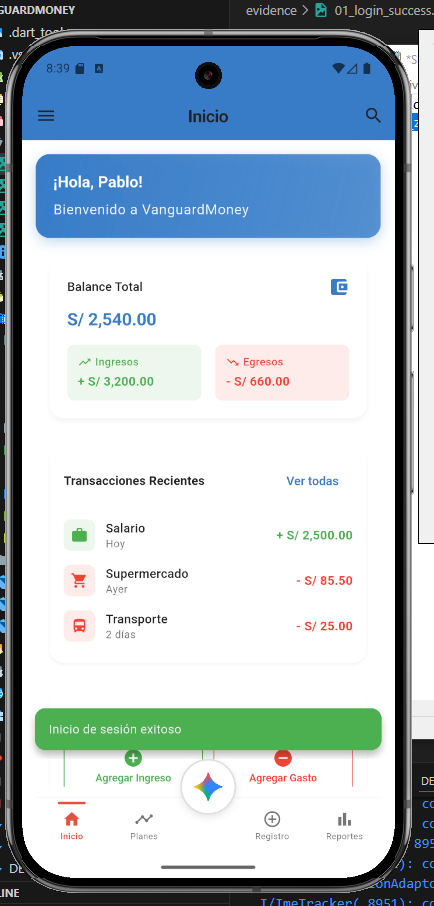
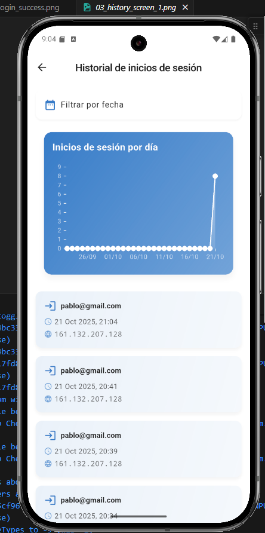
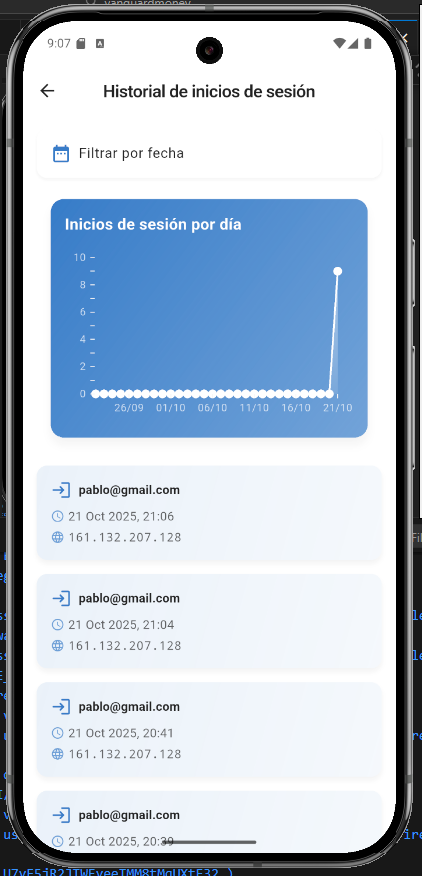

# Examen Práctico - Unidad II Móviles II

## Información General
- **Curso:** Móviles II
- **Alumno:** Erick Yoel Ayma Choque
- **Fecha:** 21 de octubre de 2025
- **Repositorio:** [SM2_EXAMEN_PRACTICO_ERICK_AYMA](https://github.com/ErickEY-13/SM2_EXAMEN_PRACTICO_ERICK_AYMA.git)

## Descripción del Proyecto
Aplicación móvil desarrollada en Flutter que implementa un sistema de registro y visualización de historial de inicios de sesión, permitiendo a los usuarios monitorear cuándo y desde dónde han accedido a su cuenta.

### Historia de Usuario
**Como** usuario autenticado,  
**Quiero** ver un historial de mis inicios de sesión,  
**Para** saber cuándo y desde qué dispositivo accedí a mi cuenta.

### Criterios de Aceptación
1. Registro de Accesos:
   - Al iniciar sesión exitosamente, se registra:
     * Información del usuario (email)
     * Fecha y hora exacta del acceso
     * Dirección IP del dispositivo

2. Visualización del Historial:
   - Sección dedicada "Historial de inicios de sesión"
   - Lista ordenada por fecha (más reciente primero)
   - Muestra detalles completos de cada acceso

3. Organización de Datos:
   - Orden cronológico inverso
   - Agrupación por fecha
   - Filtrado por rango de fechas

## Funcionalidades Implementadas

### 1. Sistema de Registro de Sesiones
- **Captura Automática:**
  * Timestamp preciso del inicio de sesión
  * Detección automática de IP del dispositivo
  * Asociación con cuenta de usuario

- **Almacenamiento:**
  * Integración con Firebase Firestore
  * Persistencia de datos entre sesiones
  * Estructura optimizada de documentos

### 2. Visualización de Historial
- **Interfaz Principal:**
  * Lista de accesos con diseño moderno
  * Cards informativas con gradientes
  * Indicadores visuales de estado

- **Características de UI:**
  * Gráfico de actividad de los últimos 30 días
  * Filtros visuales por fecha
  * Detalles expandibles por registro

### 3. Análisis y Estadísticas
- **Gráficos:**
  * Visualización de tendencias de acceso
  * Estadísticas por día
  * Patrones de uso

- **Seguridad:**
  * Registro de IP para cada sesión
  * Historial completo de actividad
  * Transparencia en el acceso a la cuenta

## Evidencias (capturas)

A continuación se incrustan las capturas provistas en la carpeta `evidence/`. Si alguna imagen no se muestra correctamente, verifica que el archivo exista en `evidence/` y que tenga el nombre exacto.

- 01_login_success.png — Inicio de sesión exitoso (pantalla de bienvenida):

- 02_session_recorded.png — Confirmación / indicador de que el inicio de sesión fue registrado:

- 03_history_screen_1.png — Pantalla "Historial de inicios de sesión" mostrando registros:

- 04_history_screen_2.png — Segunda captura de la pantalla de historial (detalle / más registros):

Repositorio entregado: https://github.com/ErickEY-13/SM2_EXAMEN_PRACTICO_ERICK_AYMA.git

Contacto:
Erick Yoel Ayma Choque

Resumen de entrega:
- Archivo `DELIVERABLE.md` con la información solicitada y las evidencias incrustadas.
- Carpeta `evidence/` con las imágenes usadas.